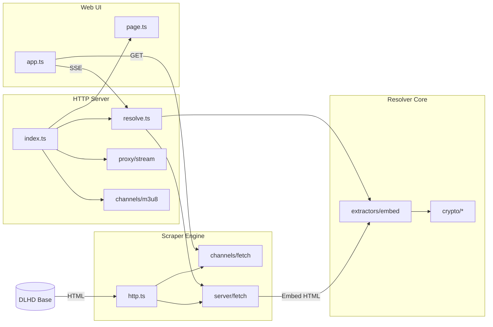

<div align="center">

# 📺 DaddyLive Stream HLS Resolver

[](https://opensource.org/licenses/MIT)
[](https://nodejs.org/)
[](https://www.typescriptlang.org/)
[](https://www.docker.com/)

**High-performance, referer-aware DaddyLive (DLHD) stream engine & dynamic IPTV playlist provider.**

Resolves DaddyLive player embeds to direct **HLS (`.m3u8`)** & **WebM** streams, proxies traffic with referer bypass headers, provides dynamic IPTV playlist generation (`.m3u8`), and enables single-click **VLC** / **MPV** stream exports.

[Quick Start](#-quick-start) • [Dynamic IPTV Playlist](#-dynamic-iptv-playlist) • [HTTP API](#-http-api) • [Docker Deployment](#-running-with-docker) • [Architecture](#-architecture)

</div>

---

## ⚡ Features

- 🍿 **7 Multi-Player Failovers** — Automatically resolves across 7 DLHD player embeds (`stream`, `cast`, `watch`, `plus`, `casting`, `player`, `hub`).
- 📻 **Dynamic IPTV M3U8 Playlist** — Serves standard IPTV playlists (`GET /playlist.m3u8`) compatible with **VLC**, **TiviMate**, **Kodi**, **IPTV Smarters**, **Plex**, and **Jellyfin**.
- 🔄 **On-Demand Stream Resolver** — Redirects (`GET /api/stream/{channelId}.m3u8`) media players on-demand with live tokens.
- 🛡️ **Referer Bypass Proxy** — Seamlessly proxies HLS master & segment playlists while injecting required upstream embed headers.
- 🖥️ **Modern Web Interface** — Sleek dark UI with live SSE progress tracking, search filtering, and one-click VLC/MPV command builders.
- ⚡ **Pure Resolver Core** — Offline-capable decryption routines (XOR, AES-CBC, Base64, obfuscation) separated from the live network scraper.

---

## 🚀 Quick Start

### Prerequisites

- **Node.js**: `v20.0.0` or higher
- **npm**: `v9.0.0` or higher

### Local Setup

```bash
# 1. Clone repository
git clone https://github.com/Lunatic16/dlhd-web.git
cd dlhd-web

# 2. Install dependencies & build
npm install

# 3. Start server
npm start
```

> [!TIP]
> The server will start on `http://localhost:3000`. You can pass `PORT=8080 npm start` to bind a custom port.

---

## 📺 Dynamic IPTV Playlist

Integrate all 24/7 channels directly into your favorite IPTV app or media client:

> **M3U Playlist URL:**  
> `http://localhost:3000/playlist.m3u8`

### Playlist Capabilities:
- Includes formatted `#EXTINF` tags: `tvg-id`, `tvg-name`, and `group-title="DaddyLive 24/7"`.
- Each channel routes to `/api/stream/{channelId}.m3u8`, which dynamically negotiates live embed tokens and proxies the HLS stream on player request.
- Compatible with **TiviMate**, **VLC**, **Kodi**, **IPTV Smarters**, **Plex / Jellyfin (xTeVe/Threadfin)**.

---

## 🐳 Running with Docker

### Using Docker Compose (Recommended)

```bash
docker compose up -d
```

### Using Docker CLI

```bash
# Build image
docker build -t daddylive-stream-resolver .

# Run container
docker run -d -p 3000:3000 --name daddylive-resolver daddylive-stream-resolver
```

---

## 🌐 Using the Web UI

The home page is a responsive single-screen stream dashboard:

1. **Select / Filter**: Search channels by name or ID in the top input.
2. **Resolve**: Click **Resolve Stream**. The server will sequentially query players 1 through 7 via Server-Sent Events (SSE).
3. **Playback & Switch**: Playback starts automatically on the first valid stream. Tap any server badge to switch players.
4. **Export**: Grab direct URLs, proxied URLs, or copy ready-to-run VLC / MPV terminal commands.

[Screenshot](https://github.com/Lunatic16/dlhd-web/blob/main/UI.png)

---

## 🧩 Scraper vs Resolver

| Aspect | 🌐 Scraper | 🔑 Resolver |
| --- | --- | --- |
| **Primary Input** | DLHD Watch URLs | Raw HTML strings |
| **Output** | Parsed channel lists, embed HTML | `ResolvedStream` object (playable URL, referer) |
| **Network Call** | Yes (`fetch` with Chrome User-Agent) | No (Pure text decryption & AST parsing) |
| **Location** | `src/channels/`, `src/server/fetch.ts` | `src/resolver/` |

> [!NOTE]
> Separating the resolver allows zero-network unit testing against saved HTML fixtures in `tmp/`.

---

## 🎯 Player Endpoints

Each UI player corresponds to a DaddyLive embed provider:

| UI Label | Internal ID | DLHD Path | Status / Notes |
| --- | --- | --- | --- |
| **PLAYER 1** | `stream` | `/stream/stream-{id}.php` | Primary HLS stream |
| **PLAYER 2** | `cast` | `/cast/stream-{id}.php` | Requires browser context (CDN 403 on server fetch) |
| **PLAYER 3** | `watch` | `/watch/stream-{id}.php` | Secondary HLS stream |
| **PLAYER 4** | `plus` | `/plus/stream-{id}.php` | Plus obfuscated player |
| **PLAYER 5** | `casting` | `/casting/stream-{id}.php` | Casting player |
| **PLAYER 6** | `player` | `/player/stream-{id}.php` | Alternative embed player |
| **PLAYER 7** | `hub` | `/hub/stream-{id}.php` | WebM / HLS Hub player |

---

## 📡 HTTP API

All endpoints respond to **`GET`** requests:

| Endpoint | Content-Type | Description |
| --- | --- | --- |
| `GET /` | `text/html` | Main Web UI Application |
| `GET /playlist.m3u8` | `application/vnd.apple.mpegurl` | Dynamic IPTV playlist containing all 24/7 channels |
| `GET /api/stream/{channelId}.m3u8` | `HTTP 302 Redirect` | Resolves channel on-demand and redirects to proxied stream |
| `GET /api/channels` | `application/json` | JSON list of available channels (`{ id, name }`) |
| `GET /api/resolve/live?channel={id}` | `text/event-stream` | Real-time SSE stream resolving all 7 players |
| `GET /api/proxy?url={url}&referer={ref}` | `stream/octet` | Proxies HLS manifests & segments with referer header |

---

## 🏗️ Architecture



---

## 📁 Project Layout

```
src/
├── channels/       # Channel catalog scrapers & M3U8 playlist generators
├── players/        # Player definitions & labels (PLAYER 1–7)
├── proxy/          # Referer-aware HLS proxy & CLI export generators
├── resolver/       # Pure HTML extractors & decryption algorithms
│   ├── crypto/     # Base64, XOR, AES-CBC, and ad-config decryptors
│   └── extractors/ # Individual player embed parsers
├── server/         # Node.js HTTP server & SSE route handlers
├── web/            # Single-page web app (HTML, TS, CSS)
├── config.ts       # Global settings (DLHD_BASE)
└── index.ts        # Library barrel exports
```

---

## 📦 Library API

Use as an ES Module dependency:

```typescript
import {
  resolveFromHtml,
  fetchChannelList,
  generateM3u8Playlist,
  buildProxyUrl,
} from "daddylive-stream-resolver";

// Fetch channels
const channels = await fetchChannelList();

// Generate M3U playlist string
const playlist = generateM3u8Playlist(channels, "http://localhost:3000");
```

---

## ⚙️ Configuration

Environment variables:

| Variable | Default Value | Description |
| --- | --- | --- |
| `PORT` | `3000` | HTTP server listening port |
| `DLHD_BASE` | `https://dlhd.st` | Upstream DaddyLive domain base |

---

## 🛠️ Development

```bash
# Run TypeScript compilation & static asset sync
npm run build

# Type check codebase
npm run typecheck

# Build and start server
npm start
```

---

## ⚠️ Known Limits

> [!WARNING]
> - **PLAYER 2 (cast)**: the cast embed CDN (dollardescent.net) returns HTTP 403 to server-side fetches; this player cannot be resolved without a browser context.
> - **Upstream Changes**: Upstream stream domains frequently rotate; some players may timeout or fail while others succeed.
> - **Sequential resolve**: All seven players run one after another; total time depends on slowest upstream responses (hub can take several seconds).

---

## 📄 Legal Notice

This software is for personal educational and research purposes only. All stream content belongs to their respective owners. The maintainers are not affiliated with DaddyLive or DLHD.

