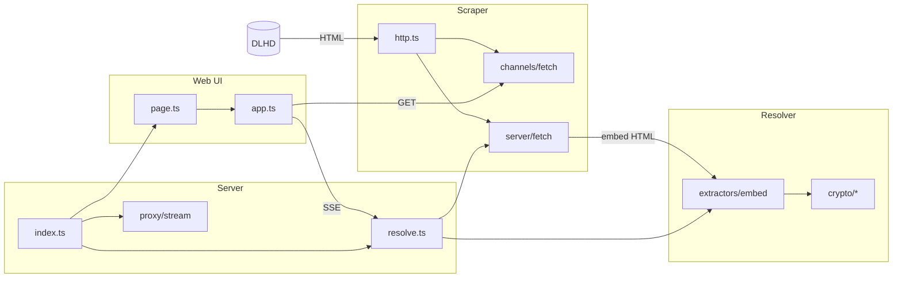

# DaddyLive Stream HLS Resolver

Resolve DaddyLive player pages into direct **HLS** (`.m3u8`) and WebM stream URLs, proxy with embed referer, play in-browser, and copy **VLC** or **MPV** commands.

---

## Table of contents

1. [Scraper vs resolver](#scraper-vs-resolver)
2. [Quick start](#quick-start)
3. [Using the web UI](#using-the-web-ui)
4. [Player endpoints](#player-endpoints)
5. [Export options](#export-options)
6. [Architecture](#architecture)
7. [Project layout](#project-layout)
8. [HTTP API](#http-api)
9. [Library API](#library-api)
10. [Configuration](#configuration)
11. [Development](#development)
12. [Known limits](#known-limits)

---

## Scraper vs resolver

Two separate jobs, two separate code areas:

| | Scraper | Resolver |
| --- | --- | --- |
| **Input** | DLHD URLs | HTML strings |
| **Output** | Parsed pages, channel lists, embed HTML | Playable stream URLs |
| **Network** | Yes — `fetch` with browser-like headers | No — pure parse/decrypt |
| **Location** | `channels/`, `server/fetch.ts`, `http.ts` | `resolver/` |

### What the scraper does

1. **Channel catalog** — fetches the 24/7 channels listing page (`/24-7-channels.php`) and parses cards/watch links into `{ id, name }` (`channels/parse.ts`, `channels/fetch.ts`).
2. **Player pages** — fetches `/stream/stream-{id}.php` (and cast, watch, plus, etc.).
3. **Embed chains** — follows iframe `src` hops and scripted redirects (wikisport, blogger-player, tinyurl) until the page contains a playable stream marker.

### What the resolver does

1. **Extract** — scans embed HTML for known player families (daddy3, plus, hub, cdnlivetv, wideiptv, igniteandship).
2. **Decrypt** — reverses XOR payloads, AES-CBC hub configs, plus obfuscation, and base64 wrappers in `resolver/crypto/`.
3. **Return** — a `ResolvedStream` with `playableUrl`, `mimeType`, and the embed page URL to use as referer.

The resolver never calls `fetch`. You can test it offline against saved HTML in `tmp/` while the scraper handles all live HTTP.

---

## Quick start

### Requirements

- Node.js 20+
- npm

### Run locally

```bash
git clone https://github.com/sharoon7171/daddylive-stream-resolver.git
cd daddylive-stream-resolver
npm install
npm start
```

Open `http://localhost:3000`. Set `PORT` to bind another port.

---

## Using the web UI

The home page is a single-screen resolver — no navigation after you submit.

### Resolve a channel

1. Open `/` in your browser.
2. Select a channel from the **Select Channel** dropdown or type into **Filter Channels** to narrow down by channel name or ID.
3. Click **Resolve Stream**.

### What happens next

- All seven players resolve **sequentially** in DLHD order (PLAYER 1 → PLAYER 7).
- Each badge shows resolve time; failures display a short error on the badge.
- When two players share the same embed, the later one is marked with a duplicate tag.
- The first successful player starts in-browser playback automatically; click any badge to switch.
- You can filter or select another channel anytime — the **Resolve Stream** button remains enabled once a player resolves or a new channel is picked.

### Playback

| Format | In-browser | Notes |
| --- | --- | --- |
| HLS (`.m3u8`) | hls.js or native Safari | Most players |
| WebM | Native `<video>` | PLAYER 7 (hub) |

---

## Player endpoints

Each UI label maps to a DLHD path segment and an internal `ServerKind` id.

| UI label | Internal id | DLHD path |
| --- | --- | --- |
| PLAYER 1 | `stream` | `/stream/stream-{id}.php` |
| PLAYER 2 | `cast` | `/cast/stream-{id}.php` |
| PLAYER 3 | `watch` | `/watch/stream-{id}.php` |
| PLAYER 4 | `plus` | `/plus/stream-{id}.php` |
| PLAYER 5 | `casting` | `/casting/stream-{id}.php` |
| PLAYER 6 | `player` | `/player/stream-{id}.php` |
| PLAYER 7 | `hub` | `/hub/stream-{id}.php` |

Source of truth: `src/players/types.ts`.

---

## Export options

After a player resolves, the **Export** panel provides four outputs:

| Export | Purpose |
| --- | --- |
| **Direct URL** | Upstream stream URL from the final embed page |
| **Proxied URL** | Same stream via `/api/proxy` with the correct embed referer |
| **VLC** | Shell command with `--http-referrer` |
| **MPV** | Shell command with `--referrer` and optional media title |

Use the proxied URL when the CDN rejects requests without the embed page referer.

---

## Architecture

The server orchestrates scrape → resolve → proxy. The diagram shows data flow; see [Scraper vs resolver](#scraper-vs-resolver) for what each layer owns.



### Live resolve sequence

1. Server reads the channel name from the cached channel list (no extra request).
2. For each player, scraper fetches the DLHD player page and walks the embed chain.
3. Resolver extracts the playable URL from the final HTML.
4. Server caches by embed URL, detects duplicates, and streams SSE events to the UI.
5. Proxy serves bytes with the correct referer when playback needs it.

---

## Project layout

```
src/
  channels/       Scraper: channel list parse + fetch (5 min cache)
  players/        PLAYER 1–7 ids and labels
  config.ts       DLHD_BASE
  http.ts         Scraper: User-Agent, headers, fetchHtml
  resolver/       Resolver: HTML → ResolvedStream (no fetch)
    resolve.ts
    types.ts
    crypto/       Base64, XOR, AES-CBC, ad-config decrypt
    extractors/   Per-embed-family parsers
  proxy/          Referer-aware stream proxy + export link builders
  server/         Orchestrates scrape + resolve over HTTP
  web/            Static UI
  index.ts        Library barrel export
```

Scratch scripts and saved HTML fixtures live in `tmp/` (not shipped).

---

## HTTP API

All routes are **GET**.

### `GET /`

HTML resolver UI.

### `GET /api/channels`

JSON array of `{ id, name }` parsed from `/24-7-channels.php`. Cached for five minutes server-side.

### `GET /api/resolve/live?channel={id}`

Server-Sent Events stream. Events:

| Event | Payload |
| --- | --- |
| `channel` | `{ id, name }` from the cached channel list |
| `start` | `{ server }` — player resolve started |
| `found` | Export object: direct, proxied, vlc, mpv, timing, duplicate info |
| `fail` | `{ server, label, error, ms }` |
| `done` | `{ channelId, channel, servers }` |

### `GET /api/proxy?url={stream}&referer={embed}`

Proxies stream bytes with the embed referer. Playlists are rewritten so segment URLs route back through this proxy.

---

## Library API

Import from `src/index.ts` (compiled to `dist/index.js`):

```typescript
import {
  resolveFromHtml,          // resolver
  extractPlayableFromHtml,  // resolver
  parseChannelList,         // scraper (parse only)
  fetchChannelList,         // scraper (live fetch, 5 min cache)
  PLAYER_IDS,
  buildProxyUrl,
} from "daddylive-stream-resolver";
```

### `ResolvedStream` type

```typescript
type ResolvedStream = {
  channelId: number;
  server: ServerKind;
  embedUrl: string;
  playableUrl: string;
  mimeType: "application/x-mpegURL" | "video/webm";
  meta: Record<string, string>;
};
```

### Resolver extractor order

`extractPlayableFromHtml` tries embed families until one matches: hub → plus → wideiptv → cdnlivetv → igniteandship → daddy3.

Embed chain walking (wikisport, blogger-player) lives in the scraper (`server/fetch.ts`) before HTML reaches the resolver.

### Offline vs live usage

| Mode | Scraper | Resolver |
| --- | --- | --- |
| Offline | Read HTML from disk (`tmp/*.html`) | `extractPlayableFromHtml(html)` |
| Live | `fetchChannelList()`, `resolveLive()` | Called internally after fetch |

---

## Configuration

| Variable | Default | Description |
| --- | --- | --- |
| `PORT` | `3000` | HTTP server port |
| `DLHD_BASE` | `https://dlhd.st` | DaddyLive origin for fetches |

---

## Development

```bash
npm run build      # tsc → dist/, copy style.css
npm run typecheck  # tsc --noEmit
npm start          # build + node dist/server/index.js
```

### Verify against fixtures

```bash
npx tsx tmp/verify-resolver.mjs local          # offline HTML fixtures
npx tsx tmp/verify-resolver.mjs live 44 stream # live resolve one player
```

---

## Known limits

- **PLAYER 2 (cast)** — the cast embed CDN (`dollardescent.net`) returns HTTP 403 to server-side fetches; this player cannot be resolved without a browser context.
- **Upstream variability** — embed hosts and CDN endpoints change by channel; some players may timeout or fail while others succeed.
- **Sequential resolve** — all seven players run one after another; total time depends on slowest upstream responses (hub can take several seconds).

---

## Legal notice

This tool parses publicly reachable pages for personal research and playback. Respect applicable copyright, terms of service, and local laws. The authors are not affiliated with DaddyLive or DLHD.
